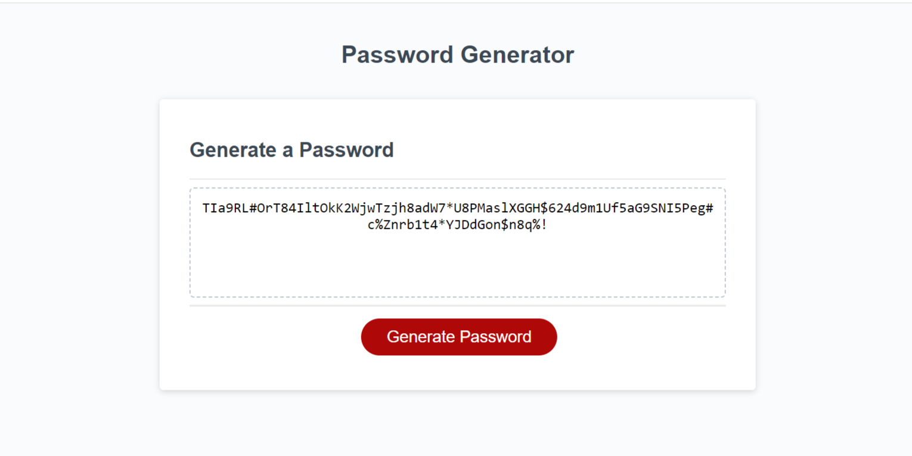

# password-gen

## Description

This is the third weekly challenge assigned to me by the Washington University Coding Boot Camp. The challenge was to create a random password generator that would allow the user to select whether they wanted to use different character types and a length for the generated password to be. We were given all the html and css that we would need, and a little bit of starting javascript to help guide us in the right direction.

Through working on this assignment, I learned more aobut working with javascript, writing functions, if statements, and for loops, and started learning how to use javascript to interact with the page itself, outside the console.

## Installation

N/A It's a webpage.

## Usage 

The webpage can be found [here](https://wolfspiderman.github.io/password-gen/)

The "Generate" button will trigger a series of confirm screens asking the user whether they would like their password to contain lowercase letters, uppercase letters, numbers, and/or special characters, followed by a prompt of how many characters they want the length of the password to be. After the final prompt, the randomly generated password will appear in place of the 'your sercure password' placeholder.

The following is a screenshot of the end result with all character types used:

## Credits

I was given the started code for this project by Washington University St. Louis Coding Boot Camp.

Special thanks to my instructor and TA for staying late in office hours to help me debug my code.

I used the following webpages to assist me in completing this challenge:

This is where I found the code that is commented out at the bottom of my javascript file.
[Javascript Program to Generate Random String](https://www.programiz.com/javascript/examples/generate-random-strings)

[MDN Web Docs on window.alert()](https://developer.mozilla.org/en-US/docs/Web/API/Window/alert)

[MDN Web Docs on window.confirm()](https://developer.mozilla.org/en-US/docs/Web/API/Window/confirm)

[MDN Web Docs on window.prompt()](https://developer.mozilla.org/en-US/docs/Web/API/Window/prompt)

## License

Licensed under the MIT License.